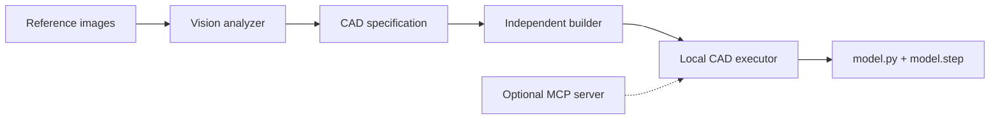

# Vision2STEP

Vision2STEP is a Claude workflow that turns reference images into editable CadQuery source
and validated STEP solids. Specialized Claude calls analyze and build; deterministic local
tools own measurement, source validation, execution, export, and STEP verification.

**Current milestone (v0.2.7):** image analysis and the first CadQuery builder/execution
pipeline are implemented. Rendering, visual grading, and iterative optimization remain on the
roadmap.



## Implemented features

- JPEG, PNG, GIF, and WebP vision input
- Token-free foreground, aspect-ratio, and enclosed-hole measurement
- Persisted deterministic measurements with image hashes
- Compact Claude structured outputs backed by Pydantic
- Explicit observed, inferred, and unknown geometry
- Independent Builder Claude context with evidence-priority rules
- Restricted, linear CadQuery source contract
- AST checks rejecting file access, extra imports, functions, loops, and dynamic execution
- Direct isolated CAD execution for the normal CLI workflow
- Optional FastMCP server and stdio client for integrations
- Immutable candidate directories
- Subprocess timeouts and sanitized environments without API keys
- STEP export, fresh STEP re-import, single-solid validation, dimensions, volume, and area
- Analyzer and builder token accounting
- Offline tests that make no live Claude calls

Vision2STEP uses Claude's documented [vision input](https://platform.claude.com/docs/en/build-with-claude/vision),
[structured outputs](https://platform.claude.com/docs/en/build-with-claude/structured-outputs),
[CadQuery STEP export](https://cadquery.readthedocs.io/en/latest/importexport.html), and the
official [Model Context Protocol Python SDK](https://github.com/modelcontextprotocol/python-sdk).

## Installation

Use Python 3.11 or 3.12. Vision2STEP currently excludes Python 3.13 because CadQuery and its
OpenCascade dependency stack can behave differently on that interpreter.

On Windows CMD:

```bat
py -3.12 -m venv .venv
.venv\Scripts\activate
python -m pip install -e ".[cad,dev]"
```

Copy `.env.example` to `.env` and add your API key:

```env
ANTHROPIC_API_KEY=your-api-key-here
ANTHROPIC_MODEL=claude-sonnet-4-6
VISION2STEP_MAX_TOKENS=3500
VISION2STEP_BUILDER_MODEL=claude-sonnet-4-6
VISION2STEP_BUILDER_MAX_TOKENS=3000
VISION2STEP_CAD_TIMEOUT=120
```

Never commit `.env`.

## Step 1: analyze an object

```bat
vision2step analyze reference.png --context "The complete left-to-right length is exactly 120 mm."
```

The default output is `artifacts/reference-analysis.json`. New analyzer artifacts use
artifact version `1.3`; the Claude specification inside remains schema version `1.2`.

Upgrade an older v1.2 report locally without spending more Claude tokens:

```bat
vision2step enrich artifacts\reference-analysis.json reference.png
```

This verifies the image SHA-256 hash and writes
`artifacts/reference-analysis-enriched.json`.

Multiple reference views can be analyzed together:

```bat
vision2step analyze front.png side.png top.png --unit mm --output artifacts/part-analysis.json
```

## Step 2: build a STEP candidate

```bat
vision2step build artifacts\reference-analysis.json --candidate-id cutting_board_001
```

The controller sends restricted source directly to the local execution service. That service
starts one isolated Python subprocess with API keys removed and accepts the candidate only after
the exported STEP file is reopened as exactly one valid solid.

Output:

```text
artifacts/candidates/cutting_board_001/
├── builder-proposal.json
├── manifest.json
├── metrics.json
├── model.py
└── model.step
```

Generate and inspect Claude's proposal without executing it:

```bat
vision2step build artifacts\reference-analysis.json \
  --candidate-id cutting_board_dry_run \
  --proposal-only
```

Successful candidates are immutable. A failed candidate ID can be retried; the failed directory
is archived under `artifacts/candidates/_failed/` first.

### Rebuild retained source without Claude

If Claude already produced `model.py`, validate and export it again without spending API tokens:

```bat
python -m vision2step execute-source artifacts\candidates\cutting_board_001\model.py ^
  --candidate-id cutting_board_001 --timeout 120
```

The command reads the source before archiving a failed candidate, so the same failed ID can be
reused safely. It exercises the same direct isolated-runner path as the normal CLI, source policy
checks, STEP export, fresh STEP re-import, and single-solid validation. It makes zero Claude API
calls.

## Included cutting-board example

[`examples/cutting_board/`](examples/cutting_board/) contains the reference image, analyzer
artifact, Builder Claude source, validated single-solid STEP file, metrics, and a top-view SVG/PNG
preview from the live v0.2.5 verification run. It is intentionally an ungraded first candidate;
the future grader is expected to improve silhouette fidelity.

## Optional CAD MCP tools

The bundled local server exposes:

| Tool | Purpose |
|---|---|
| `build_candidate` | Validate source, execute CadQuery, export STEP, and save metrics |
| `validate_step` | Reopen STEP in a fresh subprocess |
| `inspect_model` | Read saved geometry metrics |
| `list_candidate_artifacts` | List files and sizes for one candidate |

Run the server directly for MCP Inspector or another compatible client:

```bat
python -m vision2step.cad_mcp_server
```

The normal `vision2step build` and `execute-source` commands do not require the MCP server. This
avoids a Windows limitation when one Python CAD process is spawned from inside another stdio MCP
process. The server remains available for MCP Inspector and external integrations.

## Evidence priority

Builder Claude is instructed to resolve conflicts in this order:

1. Explicit physical dimensions from the user
2. Persisted deterministic image measurements
3. High-confidence observed geometry
4. Medium-confidence observed geometry
5. Component estimates
6. Inferred geometry
7. Conservative defaults

Conflicts, assumptions, and omitted optional features are retained in
`builder-proposal.json`.

## Restricted source model

Generated source must:

- import only `cadquery as cq`;
- assign the final Workplane or Shape to `result`;
- use linear assignments and approved CadQuery method chains;
- avoid functions, classes, loops, comprehensions, filesystem access, networking,
  environment access, subprocesses, and dynamic code;
- leave STEP export to the local executor.

The AST allowlist reduces risk but is not presented as a general-purpose Python sandbox.
Only run generated CAD inside the included restricted workflow.

## Testing

Run the dependency-light test suite:

```bat
python -m unittest discover -s tests -v
```

After installing development dependencies:

```bat
ruff check .
pytest
```

The suite covers analyzer contracts, geometry hints, builder isolation, source-policy
rejection, immutable workspaces, and traversal protection. A real CadQuery smoke fixture is
included under `tests/fixtures/`.

## Current limitations

- Builder execution currently supports a single final Workplane or Shape, not assemblies.
- Rendered comparison views are not implemented yet.
- The independent grader and `loop`, `final`, and `off` policies are not implemented yet.
- Builder repair after an execution error is still manual through `--revision-feedback`.
- Single-image hidden geometry remains uncertain.
- Organic, deformable, transparent, and highly reflective objects are poor initial targets.

See [`docs/architecture.md`](docs/architecture.md),
[`docs/cad-builder.md`](docs/cad-builder.md), and [`docs/roadmap.md`](docs/roadmap.md).

## Troubleshooting

### `The compiled grammar is too large`

Use analyzer specification schema `1.2`. The outer artifact may report version `1.3`
because raw deterministic geometry hints were added without expanding Claude's schema.

### `CadQuery attribute is not allowed: radiusArc`

This was a source-policy allowlist bug in version 0.2.0 and is fixed in 0.2.1. A failed
full build now removes its staged proposal automatically so the same candidate ID can be retried.
For a proposal left behind by 0.2.0, delete
`artifacts\candidates\proposals\<candidate-id>.json` once before retrying.

### `CadQuery execution exceeded 30 seconds`

Version 0.2.4 raises the default timeout to 120 seconds because the limit includes CadQuery
startup, source execution, geometry measurement, STEP export, and STEP re-import. Timeout errors
now report the active stage. A failed candidate directory is archived under
`artifacts\candidates\_failed\` on retry, so its candidate ID can be reused safely.

Override the limit for an unusually slow model with:

```bat
vision2step build artifacts\reference-analysis.json --candidate-id cutting_board_001 --timeout 240
```

Version 0.2.5 also rejects `union`, `cut`, or `intersect` between unextruded 2D profiles
before starting CadQuery. Increasing the timeout cannot repair this construction error.

Version 0.2.6 fixes a Windows-only startup failure caused by discarding required user-profile,
application-data, and virtual-environment variables before launching the MCP server and CAD runner.
Secrets remain excluded from both subprocesses. A timeout before the first runner stage is now
reported as a subprocess startup problem instead of a generated-geometry problem.

Version 0.2.7 avoids the remaining Windows double-subprocess failure: normal CLI commands launch
the isolated CAD runner directly, while the MCP server is an optional integration surface.

### CadQuery fails to install

Create the virtual environment with Python 3.11 or 3.12, then retry:

```bat
py -3.12 -m venv .venv
.venv\Scripts\activate
python -m pip install -e ".[cad]"
```

## License

MIT

### Long-running generated geometry

Version 0.2.4 executes generated source one top-level statement at a time and records the current
statement in `last-stage.txt`. A timeout now reports the exact `model.py` line range that was active.
For `planar_extrusion` objects, the builder is instructed to avoid the Sketch solver and expensive
finishing operations and to use one compact Workplane profile followed by one extrusion.
