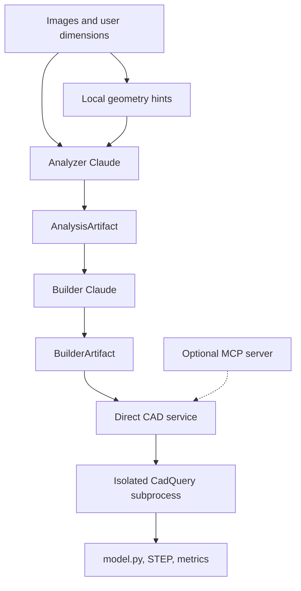

# Architecture

Vision2STEP separates probabilistic interpretation from deterministic CAD execution.

## Analyzer boundary

`VisionAnalyzer` receives the images. A local Pillow pass measures normalized geometry,
then Analyzer Claude produces the semantic CAD specification. Artifact version `1.3`
persists both sources of evidence:

- raw geometry hints, which are deterministic and higher priority;
- Claude specification schema `1.2`, which interprets components and features.

The analyzer cannot generate or execute CadQuery source.

## Builder boundary

`CadBuilder` receives only `AnalysisArtifact` plus optional revision feedback. It starts a
fresh Claude request and produces `BuilderProposal` schema `1.0`, containing:

- evidence used;
- resolved contradictions;
- assumptions;
- optional features deliberately omitted;
- expected dimensions;
- complete restricted CadQuery source.

The builder cannot write STEP files or choose arbitrary execution tools.

## Execution boundary

The normal CLI controller calls `CadExecutionService` directly. The service owns the candidate
root and starts one isolated Python CAD subprocess. API keys are removed from the runner
environment while required Windows and virtual-environment variables are preserved.

`build_candidate` performs this sequence:

1. Validate candidate ID and reject path traversal.
2. Archive an existing failed candidate, while refusing to overwrite a valid candidate.
3. Parse source into an AST and enforce the restricted language.
4. Write `model.py` into a new candidate directory.
5. Start an isolated Python subprocess with a timeout and sanitized environment.
6. Require `result` to contain exactly one valid solid with positive volume.
7. Export `model.step`.
8. Reopen the STEP file and validate it again.
9. Save dimensions, area, volume, solid count, policy report, and manifest.

## Optional MCP boundary

The bundled FastMCP stdio server exposes the same narrow CAD service operations for MCP Inspector
and external integrations. It is not placed in the normal Windows CLI execution chain because
spawning an additional Python/OpenCascade process from inside the stdio server proved unreliable
on Windows. The direct CLI path retains subprocess isolation and secret removal.

## Candidate immutability

Successful candidate directories and proposal files are never overwritten. A failed candidate is
timestamped and moved under `_failed/` before its ID is reused. This preserves evidence for the
future grader and makes retries auditable.

## Coordinate convention

The shared object frame is right-handed. For a near-orthographic planar profile, `+X`
points image-right, `+Y` image-up, and `+Z` out of the profile plane. For other objects, the
analyzer must describe the chosen axes explicitly.

## Current security scope

The source policy intentionally supports linear CadQuery modeling rather than general
Python. It rejects additional imports, dunder access, unapproved attributes, functions,
classes, control flow, comprehensions, filesystem access, networking, and dynamic code.

This is defense in depth for locally generated CAD, not a claim of complete hostile-code
sandboxing. The project must not expose the tool to arbitrary public source submission.
