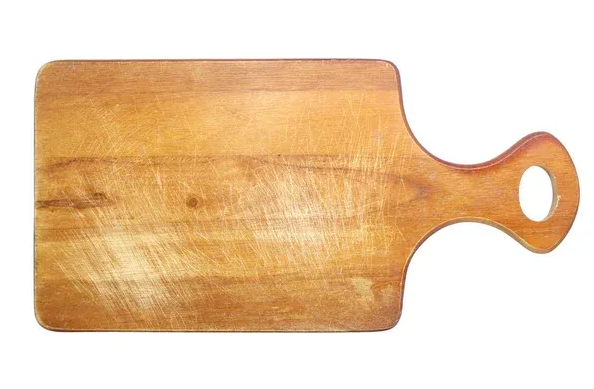
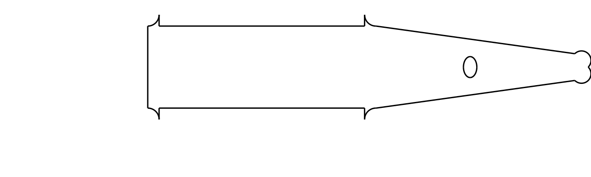

# Cutting-board baseline

This folder records the live end-to-end verification of Vision2STEP 0.2.5. Builder Claude created
`model.py`; the restricted local workflow executed it, exported `model.step`, and reopened the STEP
file as exactly one valid solid.

| Reference | Ungraded top-view candidate |
|---|---|
|  |  |

The candidate is deliberately retained as a baseline rather than presented as a final geometric
match. Its purpose is to demonstrate that the analyzer-to-builder-to-validated-STEP path works.
Visual grading and iterative refinement are the next milestone.

Files:

- `reference.png` — original reference image
- `analysis.json` — Vision Analyzer artifact used by Builder Claude
- `model.py` — restricted, editable CadQuery source
- `model.step` — exported and freshly re-imported STEP solid
- `metrics.json` — deterministic geometry and validity measurements
- `preview.svg` and `preview.png` — top-view outline previews
